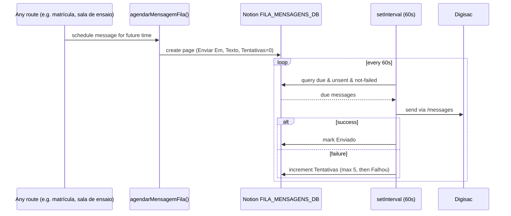
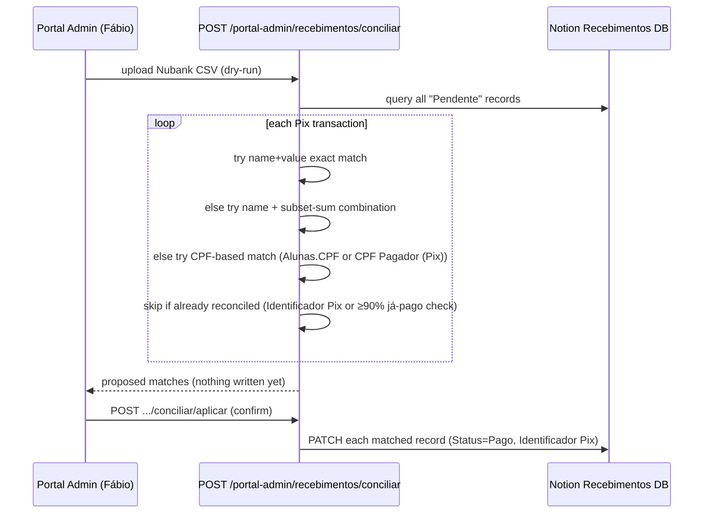
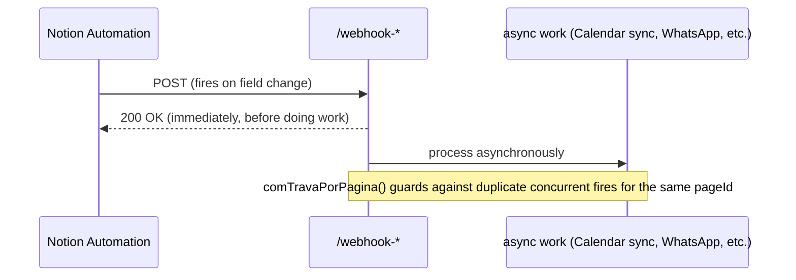

# Codebase Map

> Auto-generated by Cartographer. Last mapped: 2026-09-22T19:38:30Z

Cia do Liquidificador's backend is almost entirely **one file**: [`server.js`](../server.js) (13,361 lines, ~201k tokens — too large to fit one Claude context window in a single read). It's a single Express proxy on Railway that talks to Notion (as the database for everything), Digisac (WhatsApp), Google Calendar/Drive/Routes/Geocoding, and Microsoft Graph/OneDrive, and serves a dozen+ separate React frontends and portals. Around it sit a handful of one-off Node/Python maintenance scripts and 23 already-applied `patch_*.py` migration scripts that document how `server.js` got built up over time.

This map is split into 4 sections mirroring how it was generated (4 parallel Sonnet subagents, one per ~4,300-line chunk of `server.js` plus one for everything else) — line numbers refer to `server.js` unless stated otherwise.

## System Overview

```mermaid
graph TB
    subgraph Frontends["React frontends (FTP-hosted, Locaweb)"]
        Aereos[Agende Aéreos]
        Acro[Agende Acro]
        Infantil[Agende Infantil]
        Percussao[Percussão]
        Ensaio[Sala de Ensaio UI]
        PortalAdmin[Portal Admin]
        PortalProf[Portal Profs]
        PortalAluna[Portal Aluna]
        PortalArtista[Portal Artista]
        Matricula[Site Matrícula]
        Orcamento[Calculadora de Orçamento]
    end

    subgraph Backend["server.js — single Express app (Railway)"]
        Routes["150+ routes"]
        Queue["Notion-backed WhatsApp queue\n(setInterval, 60s poll)"]
        Locks["In-memory per-pageId locks\n(single-replica assumption)"]
        Sessions["In-memory OTP/session store"]
    end

    subgraph External["External services"]
        Notion[(Notion — the database)]
        Digisac[Digisac WhatsApp API]
        GCal[Google Calendar]
        GDrive[Google Drive]
        GRoutes[Google Routes/Geocoding/Places]
        OneDrive[Microsoft OneDrive/Graph]
        Locaweb[Locaweb FTP + SMTP]
    end

    Frontends --> Routes
    Routes --> Notion
    Routes --> Digisac
    Routes --> GCal
    Routes --> GDrive
    Routes --> GRoutes
    Routes --> OneDrive
    Routes --> Locaweb
    Queue --> Digisac
    Routes --> Queue
    Routes --> Locks
    Routes --> Sessions
```



## Directory Structure

```
Agende-Aula/
├── server.js                          # THE app — 13,361 lines, everything lives here
├── server.js.backup-portal-admin-*    # stale manual backup — candidate for deletion
├── package.json                       # proxy-digisac, Node 18.x, `npm start` = node server.js
├── CLAUDE.md                          # project instructions (read every session)
├── docs/CODEBASE_MAP.md               # this file
│
├── calcular-repasses.js               # one-off: compute teacher payouts, upsert to Notion
├── conciliar-extrato.js               # one-off: reconcile bank CSV → Pagamentos DB
├── corrigir-status-talita-guilherme.js # one-off: data repair for 2 teachers' payout records
├── extrair-repasses-planilhas.js      # read-only: cross-check payout sheets vs. calculated values
├── migrate-pagamentos.js              # one-off: migrate 5 teachers' Google Sheets → Notion (module also required by corrigir-status-*.js)
├── deploy-ftp-admin.py                # deploy Portal Admin static files to Locaweb FTP
├── planta-interativa.html             # standalone client-only floor-plan editor (no backend ties)
│
└── patch_*.py (23 files)              # already-applied, one-shot string-replacement patches to server.js
    ├── patch_orcamento_*.py (13)      # sequential chain building the budget-calculator↔Notion integration
    ├── patch_ferias_*.py (2)          # sequential chain: vacation feature, then cycle-date fix
    ├── patch_migracao_*.py (2)        # sequential chain: legacy-student onboarding, then minors support
    └── (6 standalone bugfix/feature patches)
```

## Module Guide

### server.js — Part 1: lines 1–4544

**Purpose**: Setup, external-service helpers, and the "many small enrollment apps" layer.

| Section | Lines | Purpose |
|---|---|---|
| Setup & CORS | 1–14 | Express init, 60mb JSON limit, permissive `*` CORS |
| Global constants | 16–31 | Digisac/Notion/OneDrive credentials & IDs |
| OneDrive/MS Graph helpers | 33–159 | `getMicrosoftToken`, folder-per-entity upload + share-link pattern |
| Digisac WhatsApp core | 160–212 | `getOrCreateContactId`, `enviarWhatsApp(ComImagem)` |
| Business-hours scheduling | 213–338 | `calcularProximoHorarioComercial`, Notion-backed message queue (`FILA_MENSAGENS_DB`, 60s poll) — replaces Digisac's unreliable native `scheduledAt` |
| Aéreos enrollment | 441–533 | `LIMITES_TURMAS_AEREOS`, legacy/new turma-name mapping |
| Acro / Infantil / Percussão / Commedia / Danças / Meditação | 534–1095 | One inscription flow each; **dual-write pattern**: primary DB + best-effort mirrored write into `ALUNAS_DB` |
| Presentation ↔ Google Calendar sync | 1097–1243 | `sincronizarApresentacaoComCalendar`, parses `Horário Apresentação` free text |
| Producer reminders + escalação/saída webhooks | 1245–1593 | `comTravaPorPagina()` in-memory lock (fixes a real Sept/2026 duplicate-notification incident); `agendarLembretesProdutor` |
| Professor substitution (sub) flow | 1596–1802 | `PROFESSORES_SUB`, `SUBSTITUICOES_BROADCAST` (in-memory), SIM/NÃO WhatsApp conversation |
| Residência Artística — open call | 1804–1925 | Application form with demographic self-report fields |
| **Matrícula engine** | 1927–2854 | The largest subsystem: `MODALIDADES_MATRICULA` config, contract text generation (`montarTextoContratoMatricula`), fidelity/cancellation-penalty math, férias (vacation) cycle logic, PDF + e-signature, `/matricula/inscrever` |
| Portal Admin — search/dashboard | 2895–3427 | Unified search, student/teacher detail cards, `/painel-geral` aggregator |
| Avaliação Iluminação (survey) | 3368–3427 | Simple survey → Notion mapper |
| Portal Artistas | 3429–3852 | Cast/crew self-service, OTP login, payment ETA calc (**hardcoded to `ano==='2026'`**) |
| Lista de Interesse | 3859–3900 | Waitlist capture with defensive Fábio-notify-on-failure |
| Termo de Residência | 3902–4132 | Same legal-doc-generation shape as Matrícula |
| Deslocamento (distance/toll) | 4138–4220 | Google Routes API round-trip estimate |
| Preço de combustível | 4221–4370 | **Two competing implementations** (Google Places vs. ANP spreadsheet scrape) — unresolved A/B |
| Aprovações (start) | 4374–4544+ | Approval queue for student turma/plano/cancelamento requests |

**Key exports/state**: `MODALIDADES_MATRICULA` (central pricing/turma config), `DURACAO_FIDELIDADE_MESES`, `FERIAS_DIAS_POR_PLANO`, `pageIdsEmProcessamentoPorChave` (lock Set), `SUBSTITUICOES_BROADCAST`.

**Notable gotchas**:
- Digisac `scheduledAt` is unreliable — always use the Notion-backed queue instead (repeated in 3+ places).
- `calcularVencimentoContrato` deliberately uses `setUTCMonth` not `setMonth` — local-TZ month arithmetic on a midnight-UTC date rolled to the wrong month in Brasília time for migrated records.
- Cancellation penalty = `min(valorPlano × mesesRestantes × 0.30, valorPlano × 2)`, computed from months remaining *after* the 30-day notice period.
- `buscarIntegrantePorCpfArtista` fetches up to 100 rows and matches CPF in-memory (punctuation inconsistency) — silently breaks past 100 rows.
- Four near-duplicate generic WhatsApp-send routes (`/enviar`, `/agendar`, `/notificar`, `/lembrete`).

### server.js — Part 2: lines 4544–8826

**Purpose**: Portal Admin's financial/operational core (payment reconciliation, payroll, email campaigns, AI-assisted content review) plus Portal Profs and teacher-contract legal-document generation.

| Section | Lines | Purpose |
|---|---|---|
| Aprovações (tail) | 4544–4573 | `POST /portal-admin/aprovacoes/:id/negar` |
| Ocupação de Turmas | 4575–4696 | Class capacity vs. enrollment dashboard |
| **Recebimentos** (student payment reconciliation) | 4698–5300 | Nubank CSV → Notion matching: name → value → CPF → subset-sum fallback chain (`pgtCombinacaoQueSoma`, brute-force bitmask ≤14 items) |
| **Pagamentos** (teacher payroll) | 5302–5669 | Bank-statement → payout matching; **fixed a real "phantom debt" bug** (compared cumulative-since-January instead of current-month-only, costing one teacher a fictitious R$10,720) |
| Disparos de E-mail (CRM campaigns) | 5671–6110 | Bulk SMTP sender, `dispFila` in-memory queue (single-replica), CID inline-image conversion, uses a **separate** `CRM_NOTION_TOKEN`/workspace |
| **Revisão Crítica de Trabalhos** | 6113–7022 | Human+AI content-review workflow: package export → external Claude.ai review → `=== FIELD ===` parse-back → publish to 2 Notion DBs. Explicit "no silent failures" design mandate; 3-tier vocabulary control (closed/moderated/open) |
| Aluguel de Sala de Ensaio (reconciliation) | 7025–7365 | Matches Pix to bookings by 30%/full/70%-balance amounts |
| Extrato unificado | 7367–7389 | One CSV feeds 3 reconciliation engines at once, cross-deduped |
| Cadastro de Professores | 7391–7470 | CRUD |
| Portal Prof — login/profile | 7472–7539 | OTP login, self-service update |
| Portal Prof — turmas/feriados/rendimento | 7540–7923 | Same current-month-only payroll fix reused here |
| Webhook: Proposta Aprovada → Apresentação | 7925–8027 | Discovers correct **yearly** Proposta/Apresentações DB pair dynamically via `listarTodosBancosOrcamento()` |
| **Contratos de Docência** (teacher contracts) | 8029–8826+ | PF-RPA/PJ-MEI/PJ-ME contract generation, e-signature, amendments (`aditivos`). Labor-reclassification-risk-aware clause language; `riscoAlto` heuristic auto-alerts Fábio |

**Key exports/state**: `pgtMapaCpfAlunas`, `pgtCombinacaoQueSoma`, `repAnalisarExtrato`, `dispFila` (in-memory), `revMontarDadosRevisao`/`revParsearTexto`, `montarTextoContratoProfessor`, `CAMPOS_BLOQUEADOS_ADITIVO = ['trilha','titularidade']`.

**Notable gotchas**:
- Rate-limit workaround (`setTimeout(...,350)` between sequential Notion writes) duplicated independently in ~5 places rather than centralized.
- Nubank CSV parsing regex duplicated independently across 3 reconciliation engines (Recebimentos/Pagamentos/Sala de Ensaio).
- No single idempotency mechanism — each section invented its own (unique Pix ID, substring-in-text-field, campaign+email lookup).
- Some Portal Admin routes in this range appear to have **no auth guard** (ocupação, sala-ensaio status, professores CRUD) — worth a security review pass.
- `titularidade === 'Professor traz alunos'` is explicitly blocked from generating a docência contract — that model needs a different legal instrument (space-rental, not employment-adjacent).

### server.js — Part 3: lines 8826–13361 (end of file)

**Purpose**: Reposição (make-up class) credit engine, Portal Aluna, Mural, chatbot state machine, Sala de Ensaio booking end-to-end, and the Orçamento (event budget) per-year database system.

| Section | Lines | Purpose |
|---|---|---|
| Aditivos self-service (tail) | 8826–8993 | Professor accepts/views contract amendments |
| **Cota de Reposição** (make-up credits) | 8996–9351 | `calcularCotaReposicao`, `verificarCotaReposicao` (lazy expiration), `criarCreditoReposicaoPorFalta`. Mensal = falta + end-of-month + 30d; Semestral/Anual = all credits expire together, 30d after cycle end |
| Reposição por feriado (holiday credits) | 9198–9312 | Auto-generates credits when a holiday hits a fixed class day; non-retroactive, gated at `DATA_INICIO_CREDITO_FERIADO='2026-09-22'` |
| Portal Aluna routes | 9353–9780, 10052–10309 | OTP login, presences, mensalidades, turma/plano change requests, férias, cancellation. `/solicitar-reposicao` **deprecated → HTTP 410** |
| OTP/Session mechanism | 10312–10356 | Shared `otpStore`/`sessaoStore` (in-memory, **lost on every restart** — forces re-login across all portals) |
| Mural (announcements) | 9783–10029 | Broadcast to turmas/residentes; images via OneDrive raw download-URL (not share link — Digisac needs real bytes) |
| Apresentações reports | 10358–10512 | Producer submits public-count/photos/notes post-show |
| Yoga booking | 10576–10685 | Text-substring vacancy counting (fragile) |
| **Presença (attendance)** | 10687–11023, 11259–11288 | Upsert-pattern attendance recording, auto-creates reposição credits, consecutive/monthly-falta alerting to Fábio |
| **Chatbot state machine** | 11025–11257 | `CONVERSAS_ESTADO` (in-memory Map, phone→state) — single entry point `POST /webhook-digisac` for ALL inbound WhatsApp across the whole system |
| **Sala de Ensaio pricing engine** | 11290–11515 | `getFeriadosDoAno` (locally computed national+SP-state+SP-municipal+Easter-derived holidays — Google Calendar only has national ones), tiered volume discounts |
| Contrato Online (Sala de Ensaio) | 11516–11741 | Clickwrap + PDF + audit trail |
| Sala de Ensaio confirmation/reminders | 11743–12136, 12434–12453 | `calcularHorarioAlvoLembreteSaldo` (16:30 day-before for daytime, 11:00 same-day for evening), 3h no-response nudge |
| Sala de Ensaio ↔ Google Calendar | 12326–12432 | 1:1 event sync + orphan cleanup (`/limpar-eventos-orfaos`) |
| Webhook: cancelamento | 12455–12502 | Re-fetches full page rather than trusting webhook payload fields |
| Grupos Residentes ("Cia Plá") | 12504–12701 | Detects overlap with resident's recurring slot, offers self-service remarcação (4/month, max 1/week quota) |
| **Calculadora de Orçamento** — per-year DB cloning | 12703–13361 | `clonarBancoOrcamento`/`garantirBancosOrcamentoDoAno` — auto-clones a new year's DB pair from the 2026 "molde" the first time that year's date is used |

**No `app.listen()` in this range** — server startup must be before line 8826 (not covered by any of the 3 chunks explicitly; worth a quick `grep -n "app.listen"` next time this map is refreshed).

**Notable gotchas**:
- Reposição quota **never blocks scheduling** even when a student has more open credits than her quota — a documented Sept/2026 incident (aluna Maíra Bombachini) showed the old `creditos.length > cota` check created a permanent dead-end, since scheduling is the only way to reduce open credits.
- Notion's public API **cannot create `status`- or `place`-type properties** (confirmed even via Notion's own MCP connector with full user access) — every auto-cloned yearly Orçamento DB substitutes `select`/`rich_text`, and all read/write code must branch on `statusTipo`/`enderecoTipo`.
- New Notion databases can only be created as children of one specific parent page — not at workspace root.
- The Notion Automation linking Proposta→Apresentação **must be manually recreated** for every new year's cloned database — not automatable via API; Fábio gets a WhatsApp warning when this happens.
- Orçamento's detailed cost breakdown lives **only in an XLSX file on OneDrive**, not in Notion — reloading requires re-downloading and re-parsing that spreadsheet; if the file/link breaks, the detail is unrecoverable.
- `PRESENCAS_2026_DB` and `PRESENCAS_DB` are the same literal Notion ID defined as two separate constants — redundant, worth consolidating.
- The whole chatbot state machine (`CONVERSAS_ESTADO`) is in-memory only — a restart mid-conversation silently drops context (next reply falls into "no conversation state, ignoring").

### Auxiliary scripts & patches (non-server.js)

**Root-level one-off/utility scripts** — all use raw `fetch` against Notion (never the `@notionhq/client` SDK, despite it being a listed dependency), invoked via `railway run node/python3 ...` so they inherit production env vars, and follow a `--dry-run` (default) / `--confirm` safety convention:

| File | Purpose |
|---|---|
| [`calcular-repasses.js`](../calcular-repasses.js) | Computes monthly teacher payouts (2 models: per-class flat rate vs. % of revenue), upserts to Notion Repasses. Hardcoded holiday calc + `MES_ATUAL_LIMITE=8` (needs manual updates over time). |
| [`conciliar-extrato.js`](../conciliar-extrato.js) | Reconciles Nubank CSV → Pagamentos DB. Uses the *newer* Notion `data_sources` API (`2025-09-03`) — inconsistent with the rest of the codebase's `2022-06-28`. |
| [`corrigir-status-talita-guilherme.js`](../corrigir-status-talita-guilherme.js) | One-off repair for 2 teachers' records corrupted by a header-detection bug in `migrate-pagamentos.js`; `require`s that file as a module. |
| [`extrair-repasses-planilhas.js`](../extrair-repasses-planilhas.js) | Read-only cross-check of payout figures already embedded in teachers' Google Sheets. |
| [`migrate-pagamentos.js`](../migrate-pagamentos.js) | The big one-time migration (670 lines): 5 teachers' Sheets → Notion Pagamentos, with a hardcoded `ALUNAS_MAP` (~50 students) and 3-tier fuzzy name matching. Exports `{ getSheetsClient, lerPlanilha, PLANILHAS }` for reuse. |
| [`deploy-ftp-admin.py`](../deploy-ftp-admin.py) | Deploys Portal Admin static files to Locaweb FTP; tries FTPS then falls back to plain FTP. |
| [`planta-interativa.html`](../planta-interativa.html) | Standalone client-only (React+Babel+Tailwind via CDN) floor-plan editor for the physical studio — **no backend ties at all**, persists to `localStorage` only. Building geometry hardcoded from a 1970 blueprint + 2026-08 field sketch, several dimensions flagged `aproximado: true`. |

**`patch_*.py` (23 files)** — already-applied, one-shot string-replacement patches against `server.js` (define `OLD`/`NEW` literal text, assert exactly-1 match, replace, instruct `node --check server.js` afterward). Not meant to be re-run; they're a durable audit trail. Three sequential chains:

1. **`patch_orcamento_*` (13 files)** — built the entire budget-calculator↔Notion integration incrementally: `opcoes-notion` → `salvar-notion` → `status_field` → `trabalho_tipo` → `endereco_geocode` → `endereco_lat_lng` → `endereco_lat_lon` → `carregar` → `filtro_data` → `preservar_especiais` → `fix_indice_materiais` → `persistir_modo` → `qtd_apresentacoes`. The 3-patch `geocode→lat_lng→lat_lon` sub-chain is a good example of iterative trial-and-error against an undocumented Notion field format.
2. **`patch_ferias_portal_aluna.py` → `patch_ferias_ciclo_real.py`** — ships the whole vacation-suspension feature, then fixes its cycle-date math.
3. **`patch_migracao_cadastro.py` → `patch_migracao_menor_idade.py`** — ships legacy-student self-onboarding, then generalizes it to minors in any modality.

Standalone bugfixes: `patch_autocadastro_professor.py`, `patch_cnpj_notificacao_sala.py`, `patch_diagnostico_mural_imagem.py`, `patch_digisac_fileurl.py`, `patch_fuso_contrato_sala.py`, `patch_professor_turmas_notion.py`.

**⚠️ `patch_multa_cancelamento.py` is corrupted** — despite its name implying a cancellation-penalty fix, the file actually contains the raw HTML of a Cloudflare bot-check challenge page (not Python at all), apparently saved by mistake. Dead weight; flag for deletion or regeneration.

Several patches required (and document) a **manual one-time Notion schema change** that isn't enforced by any code: `patch_ferias_portal_aluna.py` ("Ferias" select option on Presenças), `patch_migracao_cadastro.py` ("Data Aceite Migracao" field on Alunas), `patch_professor_turmas_notion.py` ("Professor" multi_select on Capacidade de Turmas).

## Data Flow

### WhatsApp reminder scheduling (the "don't trust Digisac's scheduledAt" flow)



### Bank-statement reconciliation (student payments — the most complex data flow)



### Notion-triggered webhooks (fire-and-forget pattern, used throughout)



## Conventions

- **Notion access**: raw `fetch()` to `api.notion.com/v1/...`, `Notion-Version: 2022-06-28` (except `conciliar-extrato.js`, which uses the newer `data_sources` API + `2025-09-03`), manual property-object construction per type. The `@notionhq/client` SDK is a listed dependency but essentially unused.
- **WhatsApp sends**: `enviarWhatsApp()` (immediate) vs. `enviarWhatsAppComHorarioComercial()` (respects business hours, defers via the Notion queue) vs. `enviarWhatsAppComImagem()` — always wrapped in try/catch that swallows failures so a notification error never blocks the underlying business operation.
- **Phone normalization**: `numero.replace(/\D/g,'')` then prefix `55` if 11 digits — duplicated inline dozens of times (a `normalizarTelefone()` helper exists in some sections but isn't universally used).
- **Idempotency**: no single mechanism — Notion checkboxes/fields (`Lembretes Produtor Agendados`, `Cache Notificado`), comma-joined ID lists, unique external IDs (`Identificador Pix`), or substring-in-text-field checks, chosen ad hoc per feature.
- **Concurrency**: Railway runs a single replica; every in-memory lock/queue/cache (`comTravaPorPagina`, `dispFila`, `otpStore`/`sessaoStore`, `CONVERSAS_ESTADO`, pricing/holiday caches) explicitly depends on this and would break under horizontal scaling.
- **Error handling**: try/catch per route, `[route-name]`-prefixed `console.error`, `{ ok:false, erro }` JSON — but HTTP status code usage is inconsistent (some error paths return 200 with `ok:false`, others proper 4xx/5xx).
- **"Dry-run then apply"**: every reconciliation/bulk-write flow (Recebimentos, Pagamentos, Sala de Ensaio, Revisão de Trabalhos) separates a read-only preview endpoint from a separate confirm/apply endpoint — a deliberate design principle across the whole admin surface.
- **Legal/contract documents**: contract text builders (Matrícula, Termo de Residência, Contrato Professor, Contrato Sala de Ensaio) all follow the same shape — clause-numbered template literal → SHA-256 version hash → `pdfkit` PDF → OneDrive upload → link stored back in Notion.

## Gotchas (cross-cutting, see also per-module notes above)

- **Digisac `scheduledAt` doesn't work reliably** — always use the Notion-backed queue (`agendarMensagemFila`).
- **Everything in-memory dies on redeploy**: OTP codes, sessions, chatbot conversation state, campaign send queue, pricing/holiday caches, broadcast state. Railway restarts force re-login everywhere and can drop a mid-flow WhatsApp conversation silently.
- **Concurrent webhook fires can duplicate side effects** unless guarded by `comTravaPorPagina()` — confirmed live incident, Sept/2026.
- **Two Notion tokens exist**: `NOTION_TOKEN` (main workspace) and `CRM_NOTION_TOKEN` (separate CRM workspace, email campaigns) — don't assume one token sees everything.
- **`patch_multa_cancelamento.py` is corrupted** (contains a Cloudflare challenge page, not code) — needs regeneration or deletion.
- **`server.js.backup-portal-admin-20260718-111727`** is a stale manual backup sitting in the repo root — candidate for deletion/`.gitignore`.
- **Hardcoded year gates** in several places (`ano==='2026'` in Portal Artista, `REP_MESES_LABEL`/`RENDIMENTO_MESES_LABEL` tables, `MES_ATUAL_LIMITE=8` in `calcular-repasses.js`) will need attention at each year boundary — see also CLAUDE.md's "Calculadora de orçamento" section, which already documents the equivalent per-year Notion DB cloning process.

## Navigation Guide

- **To add a new class/modality enrollment flow**: look at Part 1 (lines 534–1095) for the simple pattern (Percussão/Commedia/Danças/Meditação), or the Matrícula engine (1927–2854) if it needs contracts/pricing tiers/férias.
- **To touch WhatsApp scheduling/reminders**: always go through `agendarMensagemFila()` (Part 1, ~line 300s) — never Digisac's `scheduledAt`.
- **To modify reposição (make-up credit) rules**: Part 3, lines 8996–9351 (`calcularCotaReposicao`/`verificarCotaReposicao`/`calcularPrazoLimiteCredito`) — also see CLAUDE.md's "Cota de reposição" section for the business rules these implement.
- **To modify Sala de Ensaio pricing/holidays**: Part 3, lines 11290–11515 (`getFeriadosDoAno`, `getDescontoPacote`).
- **To touch bank-statement reconciliation**: Part 2 — Recebimentos (4698–5300, students), Pagamentos (5302–5669, teachers), Sala de Ensaio (7025–7365, room rentals). Note the CSV-parsing regex is duplicated in all three; a shared helper doesn't exist yet.
- **To modify a teacher/student contract's legal text**: `montarTextoContratoMatricula` (Part 1, ~2000s), `montarTextoContratoProfessor` (Part 2, ~8100s), `montarTextoTermoResidencia` (Part 1, ~3900s), `montarTextoContrato` for Sala de Ensaio (Part 3, ~11516) — all follow the clause-numbered-template + SHA-256-hash + PDF + OneDrive pattern.
- **To add a new year's Orçamento database**: nothing to do in code — `garantirBancosOrcamentoDoAno` (Part 3, ~12703–13361) auto-clones on first use of a new year's date. But the Notion Automation linking Proposta→Apresentação must be **manually** recreated (see CLAUDE.md).
- **To debug the WhatsApp chatbot**: `POST /webhook-digisac` (Part 3, ~11025–11257) is the single entry point for every inbound message; check `CONVERSAS_ESTADO` for the phone number's current state.
- **To find where a Notion DB ID is defined**: they're scattered across all 3 parts of `server.js` at first use, not centralized — grep the file rather than assuming a config section.
